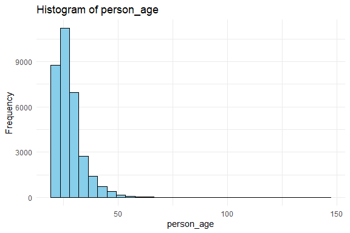

Credit Risk Assessment
================
Trevor Okinda
2024

- [Student Details](#student-details)
- [Setup Chunk](#setup-chunk)
- [Exploratory Data Analysis](#exploratory-data-analysis)
  - [Load dataset](#load-dataset)
  - [Measures of frequency](#measures-of-frequency)
  - [Measures of central tendency](#measures-of-central-tendency)
  - [Measures of Distribution](#measures-of-distribution)
  - [Measures of Relationship](#measures-of-relationship)
  - [ANOVA](#anova)
  - [Plots](#plots)
- [Preprocessing and Data
  Transformation](#preprocessing-and-data-transformation)
  - [Missing Values](#missing-values)
  - [Imputation](#imputation)
  - [Standardization](#standardization)
- [Training Model](#training-model)
  - [Data splitting](#data-splitting)
  - [Bootstrapping](#bootstrapping)
  - [Cross Validation](#cross-validation)
  - [Train Different Models](#train-different-models)
  - [Performance comparison](#performance-comparison)
  - [Saving Model](#saving-model)

# Student Details

|                       |                        |
|-----------------------|------------------------|
| **Student ID Number** | 134780                 |
| **Student Name**      | Trevor Okinda          |
| **BBIT 4.2 Group**    | C                      |
| **Project Name**      | Credit Risk Assessment |

# Setup Chunk

**Note:** the following KnitR options have been set as the global
defaults: <BR>
`knitr::opts_chunk$set(echo = TRUE, warning = FALSE, eval = TRUE, collapse = FALSE, tidy = TRUE)`.

More KnitR options are documented here
<https://bookdown.org/yihui/rmarkdown-cookbook/chunk-options.html> and
here <https://yihui.org/knitr/options/>.

# Exploratory Data Analysis

## Load dataset

``` r
# Load dataset
credit_data <- read.csv("credit_risk_dataset.csv", colClasses = c(
  person_age = "integer",
  person_income = "integer",
  person_home_ownership = "factor",
  person_emp_length = "numeric",
  loan_intent = "factor",
  loan_amnt = "integer",
  loan_int_rate = "numeric",
  loan_status = "factor",
  loan_percent_income = "numeric",
  cb_person_default_on_file = "factor",
  cb_person_cred_hist_length = "integer"
))

# Display the structure of the dataset
str(credit_data)
```

    ## 'data.frame':    32581 obs. of  11 variables:
    ##  $ person_age                : int  22 21 25 23 24 21 26 24 24 21 ...
    ##  $ person_income             : int  59000 9600 9600 65500 54400 9900 77100 78956 83000 10000 ...
    ##  $ person_home_ownership     : Factor w/ 4 levels "MORTGAGE","OTHER",..: 4 3 1 4 4 3 4 4 4 3 ...
    ##  $ person_emp_length         : num  123 5 1 4 8 2 8 5 8 6 ...
    ##  $ loan_intent               : Factor w/ 6 levels "DEBTCONSOLIDATION",..: 5 2 4 4 4 6 2 4 5 6 ...
    ##  $ loan_amnt                 : int  35000 1000 5500 35000 35000 2500 35000 35000 35000 1600 ...
    ##  $ loan_int_rate             : num  16 11.1 12.9 15.2 14.3 ...
    ##  $ loan_status               : Factor w/ 2 levels "0","1": 2 1 2 2 2 2 2 2 2 2 ...
    ##  $ loan_percent_income       : num  0.59 0.1 0.57 0.53 0.55 0.25 0.45 0.44 0.42 0.16 ...
    ##  $ cb_person_default_on_file : Factor w/ 2 levels "N","Y": 2 1 1 1 2 1 1 1 1 1 ...
    ##  $ cb_person_cred_hist_length: int  3 2 3 2 4 2 3 4 2 3 ...

``` r
# View the first few rows of the dataset
head(credit_data)
```

    ##   person_age person_income person_home_ownership person_emp_length loan_intent
    ## 1         22         59000                  RENT               123    PERSONAL
    ## 2         21          9600                   OWN                 5   EDUCATION
    ## 3         25          9600              MORTGAGE                 1     MEDICAL
    ## 4         23         65500                  RENT                 4     MEDICAL
    ## 5         24         54400                  RENT                 8     MEDICAL
    ## 6         21          9900                   OWN                 2     VENTURE
    ##   loan_amnt loan_int_rate loan_status loan_percent_income
    ## 1     35000         16.02           1                0.59
    ## 2      1000         11.14           0                0.10
    ## 3      5500         12.87           1                0.57
    ## 4     35000         15.23           1                0.53
    ## 5     35000         14.27           1                0.55
    ## 6      2500          7.14           1                0.25
    ##   cb_person_default_on_file cb_person_cred_hist_length
    ## 1                         Y                          3
    ## 2                         N                          2
    ## 3                         N                          3
    ## 4                         N                          2
    ## 5                         Y                          4
    ## 6                         N                          2

``` r
# View the dataset in a separate viewer window
View(credit_data)
```

## Measures of frequency

``` r
# Calculate frequency counts for categorical variables
frequency_counts <- lapply(credit_data[, sapply(credit_data, is.factor)], table)

# Calculate percentages for categorical variables
percentage_counts <- lapply(frequency_counts, prop.table)

# Display frequency counts
print("Frequency Counts:")
```

    ## [1] "Frequency Counts:"

``` r
print(frequency_counts)
```

    ## $person_home_ownership
    ## 
    ## MORTGAGE    OTHER      OWN     RENT 
    ##    13444      107     2584    16446 
    ## 
    ## $loan_intent
    ## 
    ## DEBTCONSOLIDATION         EDUCATION   HOMEIMPROVEMENT           MEDICAL 
    ##              5212              6453              3605              6071 
    ##          PERSONAL           VENTURE 
    ##              5521              5719 
    ## 
    ## $loan_status
    ## 
    ##     0     1 
    ## 25473  7108 
    ## 
    ## $cb_person_default_on_file
    ## 
    ##     N     Y 
    ## 26836  5745

``` r
# Display percentage counts
print("Percentage Counts:")
```

    ## [1] "Percentage Counts:"

``` r
print(percentage_counts)
```

    ## $person_home_ownership
    ## 
    ##    MORTGAGE       OTHER         OWN        RENT 
    ## 0.412633130 0.003284123 0.079310027 0.504772720 
    ## 
    ## $loan_intent
    ## 
    ## DEBTCONSOLIDATION         EDUCATION   HOMEIMPROVEMENT           MEDICAL 
    ##         0.1599705         0.1980602         0.1106473         0.1863356 
    ##          PERSONAL           VENTURE 
    ##         0.1694546         0.1755318 
    ## 
    ## $loan_status
    ## 
    ##        0        1 
    ## 0.781836 0.218164 
    ## 
    ## $cb_person_default_on_file
    ## 
    ##         N         Y 
    ## 0.8236702 0.1763298

## Measures of central tendency

``` r
# Custom function to find mode
Mode <- function(x) {
  ux <- unique(x)
  ux[which.max(tabulate(match(x, ux)))]
}

# Calculate measures of central tendency for numeric variables
central_tendency <- sapply(credit_data[, sapply(credit_data, is.numeric)], function(x) c(mean = mean(x), median = median(x), mode = Mode(x)))

# Display measures of central tendency
print("Measures of Central Tendency:")
```

    ## [1] "Measures of Central Tendency:"

``` r
print(central_tendency)
```

    ##        person_age person_income person_emp_length loan_amnt loan_int_rate
    ## mean      27.7346      66074.85                NA  9589.371            NA
    ## median    26.0000      55000.00                NA  8000.000            NA
    ## mode      23.0000      60000.00                 0 10000.000            NA
    ##        loan_percent_income cb_person_cred_hist_length
    ## mean             0.1702035                   5.804211
    ## median           0.1500000                   4.000000
    ## mode             0.1000000                   2.000000

## Measures of Distribution

``` r
# Calculate measures of distribution for numeric variables
distribution_measures <- sapply(credit_data[, sapply(credit_data, is.numeric)], function(x) c(range = diff(range(x)), variance = var(x), standard_deviation = sd(x)))

# Display measures of distribution
print("Measures of Distribution:")
```

    ## [1] "Measures of Distribution:"

``` r
print(distribution_measures)
```

    ##                    person_age person_income person_emp_length    loan_amnt
    ## range              124.000000  5.996000e+06                NA    34500.000
    ## variance            40.298100  3.841907e+09                NA 39968779.557
    ## standard_deviation   6.348078  6.198312e+04                NA     6322.087
    ##                    loan_int_rate loan_percent_income cb_person_cred_hist_length
    ## range                         NA          0.83000000                  28.000000
    ## variance                      NA          0.01140234                  16.443034
    ## standard_deviation            NA          0.10678176                   4.055001

## Measures of Relationship

``` r
# Calculate correlation coefficients for numeric variables
correlation_matrix <- cor(credit_data[, sapply(credit_data, is.numeric)])

# Display correlation matrix
print("Correlation Matrix:")
```

    ## [1] "Correlation Matrix:"

``` r
print(correlation_matrix)
```

    ##                             person_age person_income person_emp_length
    ## person_age                  1.00000000     0.1732025                NA
    ## person_income               0.17320249     1.0000000                NA
    ## person_emp_length                   NA            NA                 1
    ## loan_amnt                   0.05078707     0.2668200                NA
    ## loan_int_rate                       NA            NA                NA
    ## loan_percent_income        -0.04241139    -0.2544710                NA
    ## cb_person_cred_hist_length  0.85913319     0.1179871                NA
    ##                             loan_amnt loan_int_rate loan_percent_income
    ## person_age                 0.05078707            NA         -0.04241139
    ## person_income              0.26681997            NA         -0.25447103
    ## person_emp_length                  NA            NA                  NA
    ## loan_amnt                  1.00000000            NA          0.57261153
    ## loan_int_rate                      NA             1                  NA
    ## loan_percent_income        0.57261153            NA          1.00000000
    ## cb_person_cred_hist_length 0.04196696            NA         -0.03168975
    ##                            cb_person_cred_hist_length
    ## person_age                                 0.85913319
    ## person_income                              0.11798710
    ## person_emp_length                                  NA
    ## loan_amnt                                  0.04196696
    ## loan_int_rate                                      NA
    ## loan_percent_income                       -0.03168975
    ## cb_person_cred_hist_length                 1.00000000

## ANOVA

``` r
# Perform ANOVA tests for numeric variables against a categorical variable
anova_results <- lapply(credit_data[, sapply(credit_data, is.numeric)], function(x) {
  aov_result <- aov(x ~ loan_status, data = credit_data)
  return(summary(aov_result))
})

# Display ANOVA results
print("ANOVA Results:")
```

    ## [1] "ANOVA Results:"

``` r
print(anova_results)
```

    ## $person_age
    ##                Df  Sum Sq Mean Sq F value   Pr(>F)    
    ## loan_status     1     614   614.2   15.25 9.44e-05 ***
    ## Residuals   32579 1312298    40.3                     
    ## ---
    ## Signif. codes:  0 '***' 0.001 '**' 0.01 '*' 0.05 '.' 0.1 ' ' 1
    ## 
    ## $person_income
    ##                Df    Sum Sq   Mean Sq F value Pr(>F)    
    ## loan_status     1 2.612e+12 2.612e+12   694.3 <2e-16 ***
    ## Residuals   32579 1.226e+14 3.762e+09                   
    ## ---
    ## Signif. codes:  0 '***' 0.001 '**' 0.01 '*' 0.05 '.' 0.1 ' ' 1
    ## 
    ## $person_emp_length
    ##                Df Sum Sq Mean Sq F value Pr(>F)    
    ## loan_status     1   3700    3700   217.1 <2e-16 ***
    ## Residuals   31684 540059      17                   
    ## ---
    ## Signif. codes:  0 '***' 0.001 '**' 0.01 '*' 0.05 '.' 0.1 ' ' 1
    ## 895 observations deleted due to missingness
    ## 
    ## $loan_amnt
    ##                Df    Sum Sq   Mean Sq F value Pr(>F)    
    ## loan_status     1 1.446e+10 1.446e+10   365.8 <2e-16 ***
    ## Residuals   32579 1.288e+12 3.953e+07                   
    ## ---
    ## Signif. codes:  0 '***' 0.001 '**' 0.01 '*' 0.05 '.' 0.1 ' ' 1
    ## 
    ## $loan_int_rate
    ##                Df Sum Sq Mean Sq F value Pr(>F)    
    ## loan_status     1  34749   34749    3728 <2e-16 ***
    ## Residuals   29463 274640       9                   
    ## ---
    ## Signif. codes:  0 '***' 0.001 '**' 0.01 '*' 0.05 '.' 0.1 ' ' 1
    ## 3116 observations deleted due to missingness
    ## 
    ## $loan_percent_income
    ##                Df Sum Sq Mean Sq F value Pr(>F)    
    ## loan_status     1   53.5   53.46    5477 <2e-16 ***
    ## Residuals   32579  318.0    0.01                   
    ## ---
    ## Signif. codes:  0 '***' 0.001 '**' 0.01 '*' 0.05 '.' 0.1 ' ' 1
    ## 
    ## $cb_person_cred_hist_length
    ##                Df Sum Sq Mean Sq F value  Pr(>F)   
    ## loan_status     1    129  129.19   7.859 0.00506 **
    ## Residuals   32579 535585   16.44                   
    ## ---
    ## Signif. codes:  0 '***' 0.001 '**' 0.01 '*' 0.05 '.' 0.1 ' ' 1

## Plots

``` r
library(ggplot2)

# Univariate plots for numeric variables
numeric_variables <- credit_data[, sapply(credit_data, is.numeric)]
numeric_plots <- lapply(colnames(numeric_variables), function(variable) {
  ggplot(credit_data, aes(x = !!as.name(variable))) +
    geom_histogram(fill = "skyblue", color = "black") +
    labs(title = paste("Histogram of", variable), x = variable, y = "Frequency") +
    theme_minimal()
})

# Univariate plots for categorical variables
categorical_variables <- credit_data[, sapply(credit_data, is.factor)]
categorical_plots <- lapply(colnames(categorical_variables), function(variable) {
  ggplot(credit_data, aes(x = !!as.name(variable))) +
    geom_bar(fill = "skyblue", color = "black") +
    labs(title = paste("Bar Plot of", variable), x = variable, y = "Count") +
    theme_minimal() +
    theme(axis.text.x = element_text(angle = 45, hjust = 1))
})

# Display numeric plots
print("Numeric Variable Plots:")
```

    ## [1] "Numeric Variable Plots:"

``` r
print(numeric_plots)
```

    ## [[1]]

    ## `stat_bin()` using `bins = 30`. Pick better value with `binwidth`.

<!-- -->

    ## 
    ## [[2]]

    ## `stat_bin()` using `bins = 30`. Pick better value with `binwidth`.

<!-- -->

    ## 
    ## [[3]]

    ## `stat_bin()` using `bins = 30`. Pick better value with `binwidth`.

<!-- -->

    ## 
    ## [[4]]

    ## `stat_bin()` using `bins = 30`. Pick better value with `binwidth`.

<!-- -->

    ## 
    ## [[5]]

    ## `stat_bin()` using `bins = 30`. Pick better value with `binwidth`.

<!-- -->

    ## 
    ## [[6]]

    ## `stat_bin()` using `bins = 30`. Pick better value with `binwidth`.

<!-- -->

    ## 
    ## [[7]]

    ## `stat_bin()` using `bins = 30`. Pick better value with `binwidth`.

<!-- -->

``` r
# Display categorical plots
print("Categorical Variable Plots:")
```

    ## [1] "Categorical Variable Plots:"

``` r
print(categorical_plots)
```

    ## [[1]]

<!-- -->

    ## 
    ## [[2]]

<!-- -->

    ## 
    ## [[3]]

<!-- -->

    ## 
    ## [[4]]

<!-- -->

``` r
# Load necessary libraries
library(ggplot2)

# Scatter plot matrix for numeric variables
numeric_variables <- credit_data[, sapply(credit_data, is.numeric)]
# Scatter plot matrix for numeric variables
scatter_plot_matrix <- ggplot(credit_data, aes(x = .data[[colnames(numeric_variables)[1]]], y = .data[[colnames(numeric_variables)[2]]])) +
  geom_point(alpha = 0.5) +
  facet_wrap(~., scales = "free") +
  theme_minimal()

# Display scatter plot matrix
print("Scatter Plot Matrix:")
```

    ## [1] "Scatter Plot Matrix:"

``` r
print(scatter_plot_matrix)
```

<!-- -->

``` r
# Box plot for numeric variables against loan_status
box_plot_numeric <- lapply(colnames(numeric_variables), function(variable) {
  ggplot(credit_data, aes_string(x = "loan_status", y = variable)) +
    geom_boxplot(fill = "skyblue", color = "black") +
    labs(title = paste("Box Plot of", variable, "by Loan Status"), x = "Loan Status", y = variable) +
    theme_minimal()
})

# Grouped bar plot for categorical variables against loan_status
categorical_variables <- credit_data[, sapply(credit_data, is.factor)]
bar_plot_categorical <- lapply(colnames(categorical_variables), function(variable) {
  ggplot(credit_data, aes_string(x = "loan_status", fill = variable)) +
    geom_bar(position = "dodge") +
    labs(title = paste("Grouped Bar Plot of", variable, "by Loan Status"), x = "Loan Status", y = "Count") +
    theme_minimal()
})

# Display scatter plot matrix
print("Scatter Plot Matrix:")
```

    ## [1] "Scatter Plot Matrix:"

``` r
print(scatter_plot_matrix)
```

<!-- -->

``` r
# Display box plots for numeric variables
print("Box Plots for Numeric Variables:")
```

    ## [1] "Box Plots for Numeric Variables:"

``` r
print(box_plot_numeric)
```

    ## [[1]]

<!-- -->

    ## 
    ## [[2]]

<!-- -->

    ## 
    ## [[3]]

<!-- -->

    ## 
    ## [[4]]

<!-- -->

    ## 
    ## [[5]]

<!-- -->

    ## 
    ## [[6]]

<!-- -->

    ## 
    ## [[7]]

<!-- -->

``` r
# Display grouped bar plots for categorical variables
print("Grouped Bar Plots for Categorical Variables:")
```

    ## [1] "Grouped Bar Plots for Categorical Variables:"

``` r
print(bar_plot_categorical)
```

    ## [[1]]

<!-- -->

    ## 
    ## [[2]]

<!-- -->

    ## 
    ## [[3]]

<!-- -->

    ## 
    ## [[4]]

<!-- -->

# Preprocessing and Data Transformation

## Missing Values

``` r
# Count missing values in each column
missing_values <- colSums(is.na(credit_data))

# Display columns with missing values
print("Columns with Missing Values:")
```

    ## [1] "Columns with Missing Values:"

``` r
print(names(missing_values[missing_values > 0]))
```

    ## [1] "person_emp_length" "loan_int_rate"

``` r
# Display total number of missing values
print("Total Number of Missing Values:")
```

    ## [1] "Total Number of Missing Values:"

``` r
print(sum(missing_values))
```

    ## [1] 4011

## Imputation

``` r
# Mean imputation for missing values in numeric variables
credit_data_imputed <- credit_data

numeric_variables <- credit_data_imputed[, sapply(credit_data_imputed, is.numeric)]
for (variable in colnames(numeric_variables)) {
  if (anyNA(credit_data_imputed[[variable]])) {
    credit_data_imputed[[variable]][is.na(credit_data_imputed[[variable]])] <- mean(credit_data_imputed[[variable]], na.rm = TRUE)
  }
}

# Check if there are still missing values
missing_values_after_imputation <- colSums(is.na(credit_data_imputed))

# Display columns with missing values after imputation
print("Columns with Missing Values After Imputation:")
```

    ## [1] "Columns with Missing Values After Imputation:"

``` r
print(names(missing_values_after_imputation[missing_values_after_imputation > 0]))
```

    ## character(0)

## Standardization

``` r
# Standardization (Z-score normalization) for numeric variables
numeric_variables <- credit_data[, sapply(credit_data, is.numeric)]
standardized_numeric <- scale(numeric_variables)

# Create a new dataframe with standardized numeric variables
credit_data_standardized <- as.data.frame(standardized_numeric)
names(credit_data_standardized) <- colnames(numeric_variables)

# Display summary statistics of standardized numeric variables
summary(credit_data_standardized)
```

    ##    person_age      person_income     person_emp_length   loan_amnt      
    ##  Min.   :-1.2184   Min.   :-1.0015   Min.   :-1.1562   Min.   :-1.4377  
    ##  1st Qu.:-0.7458   1st Qu.:-0.4449   1st Qu.:-0.6734   1st Qu.:-0.7259  
    ##  Median :-0.2732   Median :-0.1787   Median :-0.1906   Median :-0.2514  
    ##  Mean   : 0.0000   Mean   : 0.0000   Mean   : 0.0000   Mean   : 0.0000  
    ##  3rd Qu.: 0.3569   3rd Qu.: 0.2117   3rd Qu.: 0.5336   3rd Qu.: 0.4129  
    ##  Max.   :18.3151   Max.   :95.7345   Max.   :28.5351   Max.   : 4.0193  
    ##                                      NA's   :895                        
    ##  loan_int_rate     loan_percent_income cb_person_cred_hist_length
    ##  Min.   :-1.7256   Min.   :-1.5939     Min.   :-0.9382           
    ##  1st Qu.:-0.9603   1st Qu.:-0.7511     1st Qu.:-0.6915           
    ##  Median :-0.0067   Median :-0.1892     Median :-0.4449           
    ##  Mean   : 0.0000   Mean   : 0.0000     Mean   : 0.0000           
    ##  3rd Qu.: 0.7586   3rd Qu.: 0.5600     3rd Qu.: 0.5415           
    ##  Max.   : 3.7675   Max.   : 6.1789     Max.   : 5.9669           
    ##  NA's   :3116

# Training Model

## Data splitting

``` r
# Load necessary libraries
library(caret)
```

    ## Loading required package: lattice

``` r
# Set seed for reproducibility
set.seed(123)

# Split the dataset into training and testing sets (70% training, 30% testing)
train_index <- createDataPartition(credit_data$loan_status, p = 0.7, list = FALSE)
train_data <- credit_data[train_index, ]
test_data <- credit_data[-train_index, ]

# Display the dimensions of the training and testing sets
print("Dimensions of Training Set:")
```

    ## [1] "Dimensions of Training Set:"

``` r
print(dim(train_data))
```

    ## [1] 22808    11

``` r
print("Dimensions of Testing Set:")
```

    ## [1] "Dimensions of Testing Set:"

``` r
print(dim(test_data))
```

    ## [1] 9773   11

## Bootstrapping

``` r
# Load necessary libraries
library(boot)
```

    ## 
    ## Attaching package: 'boot'

    ## The following object is masked from 'package:lattice':
    ## 
    ##     melanoma

``` r
# Define a function to calculate the statistic of interest (e.g., mean)
statistic_function <- function(data, index) {
  # Subset data using bootstrap indices
  bootstrap_sample <- data[index, ]
  
  # Calculate the statistic of interest (e.g., mean)
  statistic_value <- mean(bootstrap_sample$loan_amnt)
  
  return(statistic_value)
}

# Set seed for reproducibility
set.seed(123)

# Perform bootstrapping with 1000 bootstrap replicates
bootstrap_results <- boot(data = credit_data, statistic = statistic_function, R = 1000)

# Display bootstrapping results
print("Bootstrapping Results:")
```

    ## [1] "Bootstrapping Results:"

``` r
print(bootstrap_results)
```

    ## 
    ## ORDINARY NONPARAMETRIC BOOTSTRAP
    ## 
    ## 
    ## Call:
    ## boot(data = credit_data, statistic = statistic_function, R = 1000)
    ## 
    ## 
    ## Bootstrap Statistics :
    ##     original    bias    std. error
    ## t1* 9589.371 0.6484761    35.38804

## Cross Validation

``` r
# Load necessary libraries
library(caret)

# Set seed for reproducibility
set.seed(123)

# Remove rows with missing values
credit_data_clean <- na.omit(credit_data)

# Define the training control
train_control <- trainControl(method = "cv", number = 10)  # 10-fold cross-validation

# Train the model using k-fold cross-validation
cross_val_model <- train(loan_status ~ ., data = credit_data_clean, method = "glm", trControl = train_control)

# Print the model
print(cross_val_model)
```

    ## Generalized Linear Model 
    ## 
    ## 28638 samples
    ##    10 predictor
    ##     2 classes: '0', '1' 
    ## 
    ## No pre-processing
    ## Resampling: Cross-Validated (10 fold) 
    ## Summary of sample sizes: 25774, 25774, 25775, 25775, 25774, 25775, ... 
    ## Resampling results:
    ## 
    ##   Accuracy   Kappa    
    ##   0.8488721  0.4911814

## Train Different Models

``` r
# Load necessary libraries
library(caret)

# Set seed for reproducibility
set.seed(123)

# Define the training control
train_control <- trainControl(method = "cv", number = 10)  # 10-fold cross-validation

# Train logistic regression model
logistic_model <- train(loan_status ~ ., data = credit_data_clean, method = "glm", trControl = train_control)

# Train decision tree model
decision_tree_model <- train(loan_status ~ ., data = credit_data_clean, method = "rpart", trControl = train_control)

# Train gradient boosting model
gradient_boosting_model <- train(loan_status ~ ., data = credit_data_clean, method = "gbm", trControl = train_control)
```

    ## Iter   TrainDeviance   ValidDeviance   StepSize   Improve
    ##      1        1.0100             nan     0.1000    0.0175
    ##      2        0.9854             nan     0.1000    0.0120
    ##      3        0.9610             nan     0.1000    0.0122
    ##      4        0.9424             nan     0.1000    0.0087
    ##      5        0.9247             nan     0.1000    0.0090
    ##      6        0.9106             nan     0.1000    0.0069
    ##      7        0.8969             nan     0.1000    0.0069
    ##      8        0.8858             nan     0.1000    0.0053
    ##      9        0.8746             nan     0.1000    0.0055
    ##     10        0.8656             nan     0.1000    0.0042
    ##     20        0.7935             nan     0.1000    0.0035
    ##     40        0.7236             nan     0.1000    0.0011
    ##     60        0.6892             nan     0.1000    0.0007
    ##     80        0.6673             nan     0.1000    0.0003
    ##    100        0.6532             nan     0.1000    0.0003
    ##    120        0.6432             nan     0.1000    0.0001
    ##    140        0.6361             nan     0.1000    0.0001
    ##    150        0.6334             nan     0.1000    0.0001
    ## 
    ## Iter   TrainDeviance   ValidDeviance   StepSize   Improve
    ##      1        0.9863             nan     0.1000    0.0284
    ##      2        0.9441             nan     0.1000    0.0210
    ##      3        0.9116             nan     0.1000    0.0158
    ##      4        0.8826             nan     0.1000    0.0143
    ##      5        0.8620             nan     0.1000    0.0102
    ##      6        0.8409             nan     0.1000    0.0105
    ##      7        0.8238             nan     0.1000    0.0085
    ##      8        0.8081             nan     0.1000    0.0078
    ##      9        0.7949             nan     0.1000    0.0064
    ##     10        0.7812             nan     0.1000    0.0068
    ##     20        0.6934             nan     0.1000    0.0034
    ##     40        0.6266             nan     0.1000    0.0010
    ##     60        0.5896             nan     0.1000    0.0007
    ##     80        0.5668             nan     0.1000    0.0002
    ##    100        0.5508             nan     0.1000    0.0002
    ##    120        0.5402             nan     0.1000    0.0005
    ##    140        0.5312             nan     0.1000    0.0001
    ##    150        0.5286             nan     0.1000    0.0000
    ## 
    ## Iter   TrainDeviance   ValidDeviance   StepSize   Improve
    ##      1        0.9697             nan     0.1000    0.0378
    ##      2        0.9173             nan     0.1000    0.0256
    ##      3        0.8773             nan     0.1000    0.0196
    ##      4        0.8456             nan     0.1000    0.0159
    ##      5        0.8200             nan     0.1000    0.0126
    ##      6        0.7938             nan     0.1000    0.0127
    ##      7        0.7761             nan     0.1000    0.0088
    ##      8        0.7584             nan     0.1000    0.0087
    ##      9        0.7453             nan     0.1000    0.0062
    ##     10        0.7329             nan     0.1000    0.0061
    ##     20        0.6568             nan     0.1000    0.0033
    ##     40        0.5858             nan     0.1000    0.0012
    ##     60        0.5519             nan     0.1000    0.0002
    ##     80        0.5336             nan     0.1000    0.0003
    ##    100        0.5211             nan     0.1000    0.0001
    ##    120        0.5115             nan     0.1000    0.0003
    ##    140        0.5024             nan     0.1000    0.0002
    ##    150        0.4985             nan     0.1000    0.0002
    ## 
    ## Iter   TrainDeviance   ValidDeviance   StepSize   Improve
    ##      1        1.0096             nan     0.1000    0.0175
    ##      2        0.9851             nan     0.1000    0.0125
    ##      3        0.9609             nan     0.1000    0.0123
    ##      4        0.9428             nan     0.1000    0.0091
    ##      5        0.9241             nan     0.1000    0.0091
    ##      6        0.9097             nan     0.1000    0.0070
    ##      7        0.8952             nan     0.1000    0.0071
    ##      8        0.8845             nan     0.1000    0.0054
    ##      9        0.8726             nan     0.1000    0.0056
    ##     10        0.8639             nan     0.1000    0.0044
    ##     20        0.7911             nan     0.1000    0.0027
    ##     40        0.7210             nan     0.1000    0.0008
    ##     60        0.6862             nan     0.1000    0.0006
    ##     80        0.6652             nan     0.1000    0.0002
    ##    100        0.6519             nan     0.1000    0.0003
    ##    120        0.6415             nan     0.1000    0.0001
    ##    140        0.6353             nan     0.1000    0.0001
    ##    150        0.6324             nan     0.1000    0.0000
    ## 
    ## Iter   TrainDeviance   ValidDeviance   StepSize   Improve
    ##      1        0.9866             nan     0.1000    0.0289
    ##      2        0.9471             nan     0.1000    0.0205
    ##      3        0.9101             nan     0.1000    0.0183
    ##      4        0.8809             nan     0.1000    0.0146
    ##      5        0.8606             nan     0.1000    0.0100
    ##      6        0.8392             nan     0.1000    0.0108
    ##      7        0.8223             nan     0.1000    0.0086
    ##      8        0.8063             nan     0.1000    0.0080
    ##      9        0.7929             nan     0.1000    0.0066
    ##     10        0.7816             nan     0.1000    0.0057
    ##     20        0.6960             nan     0.1000    0.0024
    ##     40        0.6272             nan     0.1000    0.0009
    ##     60        0.5937             nan     0.1000    0.0006
    ##     80        0.5711             nan     0.1000    0.0004
    ##    100        0.5550             nan     0.1000    0.0002
    ##    120        0.5438             nan     0.1000    0.0003
    ##    140        0.5360             nan     0.1000   -0.0000
    ##    150        0.5325             nan     0.1000    0.0000
    ## 
    ## Iter   TrainDeviance   ValidDeviance   StepSize   Improve
    ##      1        0.9700             nan     0.1000    0.0377
    ##      2        0.9169             nan     0.1000    0.0263
    ##      3        0.8777             nan     0.1000    0.0195
    ##      4        0.8462             nan     0.1000    0.0158
    ##      5        0.8167             nan     0.1000    0.0142
    ##      6        0.7953             nan     0.1000    0.0108
    ##      7        0.7764             nan     0.1000    0.0091
    ##      8        0.7590             nan     0.1000    0.0085
    ##      9        0.7451             nan     0.1000    0.0069
    ##     10        0.7328             nan     0.1000    0.0060
    ##     20        0.6564             nan     0.1000    0.0022
    ##     40        0.5912             nan     0.1000    0.0008
    ##     60        0.5576             nan     0.1000    0.0006
    ##     80        0.5366             nan     0.1000    0.0003
    ##    100        0.5231             nan     0.1000    0.0002
    ##    120        0.5139             nan     0.1000    0.0001
    ##    140        0.5062             nan     0.1000    0.0002
    ##    150        0.5035             nan     0.1000   -0.0000
    ## 
    ## Iter   TrainDeviance   ValidDeviance   StepSize   Improve
    ##      1        1.0099             nan     0.1000    0.0178
    ##      2        0.9849             nan     0.1000    0.0128
    ##      3        0.9609             nan     0.1000    0.0121
    ##      4        0.9427             nan     0.1000    0.0094
    ##      5        0.9246             nan     0.1000    0.0089
    ##      6        0.9099             nan     0.1000    0.0072
    ##      7        0.8956             nan     0.1000    0.0067
    ##      8        0.8841             nan     0.1000    0.0056
    ##      9        0.8730             nan     0.1000    0.0055
    ##     10        0.8638             nan     0.1000    0.0045
    ##     20        0.7908             nan     0.1000    0.0033
    ##     40        0.7206             nan     0.1000    0.0010
    ##     60        0.6877             nan     0.1000    0.0006
    ##     80        0.6660             nan     0.1000    0.0005
    ##    100        0.6530             nan     0.1000    0.0002
    ##    120        0.6434             nan     0.1000    0.0000
    ##    140        0.6356             nan     0.1000    0.0002
    ##    150        0.6327             nan     0.1000    0.0001
    ## 
    ## Iter   TrainDeviance   ValidDeviance   StepSize   Improve
    ##      1        0.9879             nan     0.1000    0.0295
    ##      2        0.9447             nan     0.1000    0.0220
    ##      3        0.9125             nan     0.1000    0.0162
    ##      4        0.8833             nan     0.1000    0.0145
    ##      5        0.8624             nan     0.1000    0.0100
    ##      6        0.8409             nan     0.1000    0.0106
    ##      7        0.8259             nan     0.1000    0.0073
    ##      8        0.8085             nan     0.1000    0.0088
    ##      9        0.7937             nan     0.1000    0.0073
    ##     10        0.7821             nan     0.1000    0.0057
    ##     20        0.6939             nan     0.1000    0.0036
    ##     40        0.6251             nan     0.1000    0.0013
    ##     60        0.5929             nan     0.1000    0.0006
    ##     80        0.5676             nan     0.1000    0.0003
    ##    100        0.5535             nan     0.1000    0.0002
    ##    120        0.5427             nan     0.1000    0.0003
    ##    140        0.5351             nan     0.1000    0.0001
    ##    150        0.5304             nan     0.1000    0.0001
    ## 
    ## Iter   TrainDeviance   ValidDeviance   StepSize   Improve
    ##      1        0.9700             nan     0.1000    0.0375
    ##      2        0.9174             nan     0.1000    0.0259
    ##      3        0.8779             nan     0.1000    0.0202
    ##      4        0.8464             nan     0.1000    0.0156
    ##      5        0.8207             nan     0.1000    0.0127
    ##      6        0.7993             nan     0.1000    0.0105
    ##      7        0.7771             nan     0.1000    0.0114
    ##      8        0.7594             nan     0.1000    0.0089
    ##      9        0.7465             nan     0.1000    0.0062
    ##     10        0.7344             nan     0.1000    0.0059
    ##     20        0.6595             nan     0.1000    0.0024
    ##     40        0.5895             nan     0.1000    0.0008
    ##     60        0.5538             nan     0.1000    0.0004
    ##     80        0.5340             nan     0.1000    0.0002
    ##    100        0.5227             nan     0.1000    0.0001
    ##    120        0.5122             nan     0.1000    0.0001
    ##    140        0.5027             nan     0.1000    0.0001
    ##    150        0.4988             nan     0.1000    0.0000
    ## 
    ## Iter   TrainDeviance   ValidDeviance   StepSize   Improve
    ##      1        1.0093             nan     0.1000    0.0183
    ##      2        0.9836             nan     0.1000    0.0126
    ##      3        0.9648             nan     0.1000    0.0091
    ##      4        0.9421             nan     0.1000    0.0119
    ##      5        0.9240             nan     0.1000    0.0091
    ##      6        0.9102             nan     0.1000    0.0071
    ##      7        0.8961             nan     0.1000    0.0070
    ##      8        0.8847             nan     0.1000    0.0056
    ##      9        0.8733             nan     0.1000    0.0055
    ##     10        0.8646             nan     0.1000    0.0044
    ##     20        0.7913             nan     0.1000    0.0033
    ##     40        0.7225             nan     0.1000    0.0008
    ##     60        0.6875             nan     0.1000    0.0008
    ##     80        0.6676             nan     0.1000    0.0005
    ##    100        0.6540             nan     0.1000    0.0002
    ##    120        0.6441             nan     0.1000    0.0000
    ##    140        0.6369             nan     0.1000    0.0002
    ##    150        0.6336             nan     0.1000    0.0002
    ## 
    ## Iter   TrainDeviance   ValidDeviance   StepSize   Improve
    ##      1        0.9867             nan     0.1000    0.0290
    ##      2        0.9440             nan     0.1000    0.0216
    ##      3        0.9110             nan     0.1000    0.0163
    ##      4        0.8867             nan     0.1000    0.0125
    ##      5        0.8604             nan     0.1000    0.0132
    ##      6        0.8384             nan     0.1000    0.0106
    ##      7        0.8209             nan     0.1000    0.0088
    ##      8        0.8057             nan     0.1000    0.0077
    ##      9        0.7906             nan     0.1000    0.0070
    ##     10        0.7783             nan     0.1000    0.0063
    ##     20        0.6943             nan     0.1000    0.0027
    ##     40        0.6243             nan     0.1000    0.0010
    ##     60        0.5870             nan     0.1000    0.0007
    ##     80        0.5643             nan     0.1000    0.0004
    ##    100        0.5492             nan     0.1000    0.0004
    ##    120        0.5407             nan     0.1000    0.0001
    ##    140        0.5316             nan     0.1000    0.0002
    ##    150        0.5281             nan     0.1000   -0.0000
    ## 
    ## Iter   TrainDeviance   ValidDeviance   StepSize   Improve
    ##      1        0.9694             nan     0.1000    0.0373
    ##      2        0.9172             nan     0.1000    0.0249
    ##      3        0.8767             nan     0.1000    0.0202
    ##      4        0.8440             nan     0.1000    0.0160
    ##      5        0.8183             nan     0.1000    0.0130
    ##      6        0.7966             nan     0.1000    0.0108
    ##      7        0.7738             nan     0.1000    0.0115
    ##      8        0.7581             nan     0.1000    0.0078
    ##      9        0.7424             nan     0.1000    0.0080
    ##     10        0.7307             nan     0.1000    0.0059
    ##     20        0.6561             nan     0.1000    0.0022
    ##     40        0.5877             nan     0.1000    0.0013
    ##     60        0.5541             nan     0.1000    0.0003
    ##     80        0.5332             nan     0.1000    0.0001
    ##    100        0.5212             nan     0.1000    0.0002
    ##    120        0.5105             nan     0.1000    0.0000
    ##    140        0.5003             nan     0.1000   -0.0000
    ##    150        0.4968             nan     0.1000    0.0000
    ## 
    ## Iter   TrainDeviance   ValidDeviance   StepSize   Improve
    ##      1        1.0109             nan     0.1000    0.0175
    ##      2        0.9858             nan     0.1000    0.0126
    ##      3        0.9622             nan     0.1000    0.0116
    ##      4        0.9432             nan     0.1000    0.0092
    ##      5        0.9252             nan     0.1000    0.0090
    ##      6        0.9114             nan     0.1000    0.0070
    ##      7        0.8977             nan     0.1000    0.0069
    ##      8        0.8864             nan     0.1000    0.0055
    ##      9        0.8774             nan     0.1000    0.0043
    ##     10        0.8667             nan     0.1000    0.0052
    ##     20        0.7940             nan     0.1000    0.0025
    ##     40        0.7232             nan     0.1000    0.0009
    ##     60        0.6893             nan     0.1000    0.0007
    ##     80        0.6674             nan     0.1000    0.0005
    ##    100        0.6546             nan     0.1000    0.0003
    ##    120        0.6447             nan     0.1000    0.0002
    ##    140        0.6378             nan     0.1000    0.0000
    ##    150        0.6346             nan     0.1000    0.0001
    ## 
    ## Iter   TrainDeviance   ValidDeviance   StepSize   Improve
    ##      1        0.9877             nan     0.1000    0.0283
    ##      2        0.9448             nan     0.1000    0.0211
    ##      3        0.9120             nan     0.1000    0.0164
    ##      4        0.8877             nan     0.1000    0.0118
    ##      5        0.8615             nan     0.1000    0.0132
    ##      6        0.8406             nan     0.1000    0.0106
    ##      7        0.8256             nan     0.1000    0.0075
    ##      8        0.8089             nan     0.1000    0.0085
    ##      9        0.7947             nan     0.1000    0.0069
    ##     10        0.7813             nan     0.1000    0.0063
    ##     20        0.6973             nan     0.1000    0.0022
    ##     40        0.6280             nan     0.1000    0.0010
    ##     60        0.5931             nan     0.1000    0.0006
    ##     80        0.5693             nan     0.1000    0.0005
    ##    100        0.5548             nan     0.1000    0.0001
    ##    120        0.5433             nan     0.1000    0.0002
    ##    140        0.5345             nan     0.1000    0.0001
    ##    150        0.5315             nan     0.1000    0.0001
    ## 
    ## Iter   TrainDeviance   ValidDeviance   StepSize   Improve
    ##      1        0.9697             nan     0.1000    0.0373
    ##      2        0.9176             nan     0.1000    0.0261
    ##      3        0.8783             nan     0.1000    0.0200
    ##      4        0.8468             nan     0.1000    0.0154
    ##      5        0.8217             nan     0.1000    0.0126
    ##      6        0.7962             nan     0.1000    0.0130
    ##      7        0.7776             nan     0.1000    0.0090
    ##      8        0.7601             nan     0.1000    0.0090
    ##      9        0.7449             nan     0.1000    0.0074
    ##     10        0.7338             nan     0.1000    0.0056
    ##     20        0.6584             nan     0.1000    0.0024
    ##     40        0.5891             nan     0.1000    0.0009
    ##     60        0.5551             nan     0.1000    0.0007
    ##     80        0.5366             nan     0.1000    0.0004
    ##    100        0.5227             nan     0.1000    0.0001
    ##    120        0.5132             nan     0.1000    0.0000
    ##    140        0.5052             nan     0.1000    0.0001
    ##    150        0.4995             nan     0.1000    0.0001
    ## 
    ## Iter   TrainDeviance   ValidDeviance   StepSize   Improve
    ##      1        1.0093             nan     0.1000    0.0181
    ##      2        0.9842             nan     0.1000    0.0127
    ##      3        0.9606             nan     0.1000    0.0120
    ##      4        0.9415             nan     0.1000    0.0091
    ##      5        0.9240             nan     0.1000    0.0088
    ##      6        0.9093             nan     0.1000    0.0070
    ##      7        0.8948             nan     0.1000    0.0072
    ##      8        0.8835             nan     0.1000    0.0053
    ##      9        0.8726             nan     0.1000    0.0055
    ##     10        0.8638             nan     0.1000    0.0044
    ##     20        0.7926             nan     0.1000    0.0026
    ##     40        0.7185             nan     0.1000    0.0009
    ##     60        0.6851             nan     0.1000    0.0009
    ##     80        0.6636             nan     0.1000    0.0004
    ##    100        0.6495             nan     0.1000    0.0003
    ##    120        0.6405             nan     0.1000    0.0002
    ##    140        0.6339             nan     0.1000    0.0000
    ##    150        0.6304             nan     0.1000    0.0000
    ## 
    ## Iter   TrainDeviance   ValidDeviance   StepSize   Improve
    ##      1        0.9860             nan     0.1000    0.0286
    ##      2        0.9454             nan     0.1000    0.0207
    ##      3        0.9086             nan     0.1000    0.0181
    ##      4        0.8848             nan     0.1000    0.0121
    ##      5        0.8586             nan     0.1000    0.0132
    ##      6        0.8379             nan     0.1000    0.0104
    ##      7        0.8203             nan     0.1000    0.0086
    ##      8        0.8039             nan     0.1000    0.0075
    ##      9        0.7903             nan     0.1000    0.0069
    ##     10        0.7774             nan     0.1000    0.0064
    ##     20        0.6942             nan     0.1000    0.0023
    ##     40        0.6224             nan     0.1000    0.0010
    ##     60        0.5887             nan     0.1000    0.0005
    ##     80        0.5664             nan     0.1000    0.0004
    ##    100        0.5508             nan     0.1000    0.0003
    ##    120        0.5400             nan     0.1000    0.0002
    ##    140        0.5306             nan     0.1000    0.0003
    ##    150        0.5269             nan     0.1000    0.0001
    ## 
    ## Iter   TrainDeviance   ValidDeviance   StepSize   Improve
    ##      1        0.9692             nan     0.1000    0.0376
    ##      2        0.9172             nan     0.1000    0.0265
    ##      3        0.8780             nan     0.1000    0.0195
    ##      4        0.8463             nan     0.1000    0.0159
    ##      5        0.8204             nan     0.1000    0.0127
    ##      6        0.7985             nan     0.1000    0.0108
    ##      7        0.7755             nan     0.1000    0.0113
    ##      8        0.7606             nan     0.1000    0.0072
    ##      9        0.7466             nan     0.1000    0.0072
    ##     10        0.7344             nan     0.1000    0.0063
    ##     20        0.6564             nan     0.1000    0.0026
    ##     40        0.5865             nan     0.1000    0.0010
    ##     60        0.5539             nan     0.1000    0.0004
    ##     80        0.5351             nan     0.1000    0.0003
    ##    100        0.5226             nan     0.1000    0.0001
    ##    120        0.5093             nan     0.1000    0.0002
    ##    140        0.5003             nan     0.1000    0.0004
    ##    150        0.4970             nan     0.1000   -0.0000
    ## 
    ## Iter   TrainDeviance   ValidDeviance   StepSize   Improve
    ##      1        1.0092             nan     0.1000    0.0180
    ##      2        0.9841             nan     0.1000    0.0123
    ##      3        0.9654             nan     0.1000    0.0091
    ##      4        0.9420             nan     0.1000    0.0117
    ##      5        0.9239             nan     0.1000    0.0089
    ##      6        0.9101             nan     0.1000    0.0071
    ##      7        0.8964             nan     0.1000    0.0068
    ##      8        0.8854             nan     0.1000    0.0053
    ##      9        0.8739             nan     0.1000    0.0057
    ##     10        0.8647             nan     0.1000    0.0043
    ##     20        0.7936             nan     0.1000    0.0025
    ##     40        0.7203             nan     0.1000    0.0012
    ##     60        0.6861             nan     0.1000    0.0008
    ##     80        0.6656             nan     0.1000    0.0003
    ##    100        0.6524             nan     0.1000    0.0004
    ##    120        0.6425             nan     0.1000    0.0002
    ##    140        0.6355             nan     0.1000    0.0001
    ##    150        0.6328             nan     0.1000    0.0002
    ## 
    ## Iter   TrainDeviance   ValidDeviance   StepSize   Improve
    ##      1        0.9857             nan     0.1000    0.0289
    ##      2        0.9426             nan     0.1000    0.0213
    ##      3        0.9102             nan     0.1000    0.0170
    ##      4        0.8814             nan     0.1000    0.0143
    ##      5        0.8606             nan     0.1000    0.0105
    ##      6        0.8391             nan     0.1000    0.0106
    ##      7        0.8211             nan     0.1000    0.0085
    ##      8        0.8063             nan     0.1000    0.0076
    ##      9        0.7921             nan     0.1000    0.0071
    ##     10        0.7800             nan     0.1000    0.0057
    ##     20        0.6940             nan     0.1000    0.0024
    ##     40        0.6259             nan     0.1000    0.0007
    ##     60        0.5884             nan     0.1000    0.0012
    ##     80        0.5664             nan     0.1000    0.0005
    ##    100        0.5521             nan     0.1000    0.0002
    ##    120        0.5417             nan     0.1000    0.0001
    ##    140        0.5316             nan     0.1000    0.0002
    ##    150        0.5282             nan     0.1000    0.0002
    ## 
    ## Iter   TrainDeviance   ValidDeviance   StepSize   Improve
    ##      1        0.9688             nan     0.1000    0.0380
    ##      2        0.9165             nan     0.1000    0.0257
    ##      3        0.8771             nan     0.1000    0.0202
    ##      4        0.8461             nan     0.1000    0.0152
    ##      5        0.8199             nan     0.1000    0.0134
    ##      6        0.7987             nan     0.1000    0.0108
    ##      7        0.7749             nan     0.1000    0.0113
    ##      8        0.7600             nan     0.1000    0.0074
    ##      9        0.7461             nan     0.1000    0.0070
    ##     10        0.7338             nan     0.1000    0.0057
    ##     20        0.6554             nan     0.1000    0.0019
    ##     40        0.5858             nan     0.1000    0.0013
    ##     60        0.5517             nan     0.1000    0.0005
    ##     80        0.5334             nan     0.1000    0.0003
    ##    100        0.5224             nan     0.1000    0.0002
    ##    120        0.5120             nan     0.1000    0.0001
    ##    140        0.5037             nan     0.1000    0.0000
    ##    150        0.5002             nan     0.1000    0.0002
    ## 
    ## Iter   TrainDeviance   ValidDeviance   StepSize   Improve
    ##      1        1.0091             nan     0.1000    0.0182
    ##      2        0.9845             nan     0.1000    0.0124
    ##      3        0.9603             nan     0.1000    0.0119
    ##      4        0.9424             nan     0.1000    0.0091
    ##      5        0.9248             nan     0.1000    0.0090
    ##      6        0.9109             nan     0.1000    0.0070
    ##      7        0.8967             nan     0.1000    0.0069
    ##      8        0.8858             nan     0.1000    0.0055
    ##      9        0.8749             nan     0.1000    0.0053
    ##     10        0.8654             nan     0.1000    0.0045
    ##     20        0.7943             nan     0.1000    0.0029
    ##     40        0.7234             nan     0.1000    0.0012
    ##     60        0.6887             nan     0.1000    0.0007
    ##     80        0.6685             nan     0.1000    0.0003
    ##    100        0.6545             nan     0.1000    0.0001
    ##    120        0.6443             nan     0.1000    0.0003
    ##    140        0.6373             nan     0.1000    0.0001
    ##    150        0.6346             nan     0.1000    0.0000
    ## 
    ## Iter   TrainDeviance   ValidDeviance   StepSize   Improve
    ##      1        0.9872             nan     0.1000    0.0289
    ##      2        0.9438             nan     0.1000    0.0211
    ##      3        0.9115             nan     0.1000    0.0164
    ##      4        0.8820             nan     0.1000    0.0144
    ##      5        0.8614             nan     0.1000    0.0099
    ##      6        0.8401             nan     0.1000    0.0106
    ##      7        0.8229             nan     0.1000    0.0086
    ##      8        0.8081             nan     0.1000    0.0074
    ##      9        0.7936             nan     0.1000    0.0072
    ##     10        0.7809             nan     0.1000    0.0062
    ##     20        0.6980             nan     0.1000    0.0021
    ##     40        0.6289             nan     0.1000    0.0013
    ##     60        0.5919             nan     0.1000    0.0013
    ##     80        0.5680             nan     0.1000    0.0001
    ##    100        0.5550             nan     0.1000    0.0002
    ##    120        0.5449             nan     0.1000    0.0002
    ##    140        0.5351             nan     0.1000    0.0003
    ##    150        0.5316             nan     0.1000    0.0002
    ## 
    ## Iter   TrainDeviance   ValidDeviance   StepSize   Improve
    ##      1        0.9690             nan     0.1000    0.0380
    ##      2        0.9164             nan     0.1000    0.0264
    ##      3        0.8768             nan     0.1000    0.0200
    ##      4        0.8448             nan     0.1000    0.0156
    ##      5        0.8193             nan     0.1000    0.0129
    ##      6        0.7948             nan     0.1000    0.0126
    ##      7        0.7762             nan     0.1000    0.0093
    ##      8        0.7576             nan     0.1000    0.0093
    ##      9        0.7453             nan     0.1000    0.0060
    ##     10        0.7328             nan     0.1000    0.0060
    ##     20        0.6559             nan     0.1000    0.0028
    ##     40        0.5909             nan     0.1000    0.0009
    ##     60        0.5551             nan     0.1000    0.0004
    ##     80        0.5355             nan     0.1000    0.0002
    ##    100        0.5229             nan     0.1000    0.0002
    ##    120        0.5124             nan     0.1000    0.0003
    ##    140        0.5039             nan     0.1000    0.0000
    ##    150        0.4991             nan     0.1000    0.0002
    ## 
    ## Iter   TrainDeviance   ValidDeviance   StepSize   Improve
    ##      1        1.0090             nan     0.1000    0.0176
    ##      2        0.9843             nan     0.1000    0.0123
    ##      3        0.9599             nan     0.1000    0.0119
    ##      4        0.9412             nan     0.1000    0.0090
    ##      5        0.9231             nan     0.1000    0.0089
    ##      6        0.9089             nan     0.1000    0.0068
    ##      7        0.8940             nan     0.1000    0.0071
    ##      8        0.8834             nan     0.1000    0.0054
    ##      9        0.8746             nan     0.1000    0.0043
    ##     10        0.8632             nan     0.1000    0.0056
    ##     20        0.7911             nan     0.1000    0.0033
    ##     40        0.7208             nan     0.1000    0.0010
    ##     60        0.6866             nan     0.1000    0.0004
    ##     80        0.6655             nan     0.1000    0.0004
    ##    100        0.6517             nan     0.1000    0.0002
    ##    120        0.6422             nan     0.1000    0.0003
    ##    140        0.6351             nan     0.1000    0.0001
    ##    150        0.6327             nan     0.1000    0.0001
    ## 
    ## Iter   TrainDeviance   ValidDeviance   StepSize   Improve
    ##      1        0.9861             nan     0.1000    0.0287
    ##      2        0.9437             nan     0.1000    0.0214
    ##      3        0.9113             nan     0.1000    0.0164
    ##      4        0.8821             nan     0.1000    0.0144
    ##      5        0.8613             nan     0.1000    0.0104
    ##      6        0.8397             nan     0.1000    0.0109
    ##      7        0.8218             nan     0.1000    0.0087
    ##      8        0.8064             nan     0.1000    0.0073
    ##      9        0.7929             nan     0.1000    0.0066
    ##     10        0.7790             nan     0.1000    0.0071
    ##     20        0.6959             nan     0.1000    0.0040
    ##     40        0.6270             nan     0.1000    0.0013
    ##     60        0.5893             nan     0.1000    0.0006
    ##     80        0.5666             nan     0.1000    0.0008
    ##    100        0.5525             nan     0.1000    0.0002
    ##    120        0.5429             nan     0.1000    0.0001
    ##    140        0.5339             nan     0.1000    0.0001
    ##    150        0.5305             nan     0.1000   -0.0000
    ## 
    ## Iter   TrainDeviance   ValidDeviance   StepSize   Improve
    ##      1        0.9685             nan     0.1000    0.0376
    ##      2        0.9163             nan     0.1000    0.0264
    ##      3        0.8768             nan     0.1000    0.0203
    ##      4        0.8451             nan     0.1000    0.0159
    ##      5        0.8194             nan     0.1000    0.0129
    ##      6        0.7979             nan     0.1000    0.0106
    ##      7        0.7759             nan     0.1000    0.0112
    ##      8        0.7581             nan     0.1000    0.0087
    ##      9        0.7447             nan     0.1000    0.0065
    ##     10        0.7334             nan     0.1000    0.0056
    ##     20        0.6583             nan     0.1000    0.0025
    ##     40        0.5872             nan     0.1000    0.0014
    ##     60        0.5554             nan     0.1000    0.0005
    ##     80        0.5385             nan     0.1000    0.0003
    ##    100        0.5250             nan     0.1000    0.0001
    ##    120        0.5153             nan     0.1000    0.0000
    ##    140        0.5063             nan     0.1000    0.0001
    ##    150        0.5021             nan     0.1000    0.0001
    ## 
    ## Iter   TrainDeviance   ValidDeviance   StepSize   Improve
    ##      1        1.0103             nan     0.1000    0.0173
    ##      2        0.9863             nan     0.1000    0.0121
    ##      3        0.9622             nan     0.1000    0.0115
    ##      4        0.9443             nan     0.1000    0.0090
    ##      5        0.9300             nan     0.1000    0.0068
    ##      6        0.9130             nan     0.1000    0.0086
    ##      7        0.8989             nan     0.1000    0.0070
    ##      8        0.8883             nan     0.1000    0.0055
    ##      9        0.8773             nan     0.1000    0.0054
    ##     10        0.8685             nan     0.1000    0.0043
    ##     20        0.7974             nan     0.1000    0.0026
    ##     40        0.7258             nan     0.1000    0.0008
    ##     60        0.6905             nan     0.1000    0.0005
    ##     80        0.6709             nan     0.1000    0.0003
    ##    100        0.6561             nan     0.1000    0.0004
    ##    120        0.6464             nan     0.1000    0.0001
    ##    140        0.6397             nan     0.1000    0.0000
    ##    150        0.6364             nan     0.1000    0.0001
    ## 
    ## Iter   TrainDeviance   ValidDeviance   StepSize   Improve
    ##      1        0.9884             nan     0.1000    0.0287
    ##      2        0.9456             nan     0.1000    0.0210
    ##      3        0.9138             nan     0.1000    0.0160
    ##      4        0.8897             nan     0.1000    0.0115
    ##      5        0.8633             nan     0.1000    0.0130
    ##      6        0.8434             nan     0.1000    0.0102
    ##      7        0.8257             nan     0.1000    0.0086
    ##      8        0.8092             nan     0.1000    0.0086
    ##      9        0.7955             nan     0.1000    0.0067
    ##     10        0.7827             nan     0.1000    0.0063
    ##     20        0.6983             nan     0.1000    0.0030
    ##     40        0.6290             nan     0.1000    0.0012
    ##     60        0.5920             nan     0.1000    0.0007
    ##     80        0.5693             nan     0.1000    0.0004
    ##    100        0.5542             nan     0.1000    0.0001
    ##    120        0.5439             nan     0.1000    0.0001
    ##    140        0.5358             nan     0.1000    0.0001
    ##    150        0.5317             nan     0.1000    0.0002
    ## 
    ## Iter   TrainDeviance   ValidDeviance   StepSize   Improve
    ##      1        0.9705             nan     0.1000    0.0382
    ##      2        0.9194             nan     0.1000    0.0258
    ##      3        0.8794             nan     0.1000    0.0195
    ##      4        0.8486             nan     0.1000    0.0155
    ##      5        0.8232             nan     0.1000    0.0126
    ##      6        0.7974             nan     0.1000    0.0126
    ##      7        0.7785             nan     0.1000    0.0092
    ##      8        0.7618             nan     0.1000    0.0084
    ##      9        0.7489             nan     0.1000    0.0063
    ##     10        0.7352             nan     0.1000    0.0068
    ##     20        0.6580             nan     0.1000    0.0025
    ##     40        0.5882             nan     0.1000    0.0008
    ##     60        0.5557             nan     0.1000    0.0005
    ##     80        0.5357             nan     0.1000    0.0008
    ##    100        0.5222             nan     0.1000    0.0001
    ##    120        0.5136             nan     0.1000    0.0002
    ##    140        0.5051             nan     0.1000    0.0001
    ##    150        0.5012             nan     0.1000    0.0003
    ## 
    ## Iter   TrainDeviance   ValidDeviance   StepSize   Improve
    ##      1        0.9692             nan     0.1000    0.0375
    ##      2        0.9165             nan     0.1000    0.0259
    ##      3        0.8765             nan     0.1000    0.0198
    ##      4        0.8453             nan     0.1000    0.0161
    ##      5        0.8203             nan     0.1000    0.0125
    ##      6        0.7944             nan     0.1000    0.0125
    ##      7        0.7766             nan     0.1000    0.0089
    ##      8        0.7589             nan     0.1000    0.0088
    ##      9        0.7462             nan     0.1000    0.0062
    ##     10        0.7348             nan     0.1000    0.0056
    ##     20        0.6589             nan     0.1000    0.0024
    ##     40        0.5873             nan     0.1000    0.0010
    ##     60        0.5541             nan     0.1000    0.0005
    ##     80        0.5347             nan     0.1000    0.0003
    ##    100        0.5223             nan     0.1000    0.0000
    ##    120        0.5135             nan     0.1000    0.0002
    ##    140        0.5056             nan     0.1000    0.0001
    ##    150        0.5019             nan     0.1000    0.0001

``` r
# Print the models
print("Logistic Regression Model:")
```

    ## [1] "Logistic Regression Model:"

``` r
print(logistic_model)
```

    ## Generalized Linear Model 
    ## 
    ## 28638 samples
    ##    10 predictor
    ##     2 classes: '0', '1' 
    ## 
    ## No pre-processing
    ## Resampling: Cross-Validated (10 fold) 
    ## Summary of sample sizes: 25774, 25774, 25775, 25775, 25774, 25775, ... 
    ## Resampling results:
    ## 
    ##   Accuracy   Kappa    
    ##   0.8488721  0.4911814

``` r
print("Decision Tree Model:")
```

    ## [1] "Decision Tree Model:"

``` r
print(decision_tree_model)
```

    ## CART 
    ## 
    ## 28638 samples
    ##    10 predictor
    ##     2 classes: '0', '1' 
    ## 
    ## No pre-processing
    ## Resampling: Cross-Validated (10 fold) 
    ## Summary of sample sizes: 25775, 25774, 25774, 25774, 25774, 25774, ... 
    ## Resampling results across tuning parameters:
    ## 
    ##   cp          Accuracy   Kappa    
    ##   0.04376914  0.8669932  0.5156998
    ##   0.10768983  0.8395121  0.4118117
    ##   0.22327906  0.8052268  0.1935485
    ## 
    ## Accuracy was used to select the optimal model using the largest value.
    ## The final value used for the model was cp = 0.04376914.

``` r
print("Gradient Boosting Model:")
```

    ## [1] "Gradient Boosting Model:"

``` r
print(gradient_boosting_model)
```

    ## Stochastic Gradient Boosting 
    ## 
    ## 28638 samples
    ##    10 predictor
    ##     2 classes: '0', '1' 
    ## 
    ## No pre-processing
    ## Resampling: Cross-Validated (10 fold) 
    ## Summary of sample sizes: 25774, 25773, 25775, 25775, 25774, 25774, ... 
    ## Resampling results across tuning parameters:
    ## 
    ##   interaction.depth  n.trees  Accuracy   Kappa    
    ##   1                   50      0.8691244  0.5303651
    ##   1                  100      0.8782737  0.6000645
    ##   1                  150      0.8801239  0.6106952
    ##   2                   50      0.8928694  0.6345807
    ##   2                  100      0.9007959  0.6724414
    ##   2                  150      0.9042530  0.6857455
    ##   3                   50      0.8985959  0.6613146
    ##   3                  100      0.9058942  0.6907311
    ##   3                  150      0.9108877  0.7083385
    ## 
    ## Tuning parameter 'shrinkage' was held constant at a value of 0.1
    ## 
    ## Tuning parameter 'n.minobsinnode' was held constant at a value of 10
    ## Accuracy was used to select the optimal model using the largest value.
    ## The final values used for the model were n.trees = 150, interaction.depth =
    ##  3, shrinkage = 0.1 and n.minobsinnode = 10.

## Performance comparison

``` r
# Load necessary libraries
library(caret)

# Set seed for reproducibility
set.seed(123)

# Remove rows with missing values
credit_data_clean <- na.omit(credit_data)

# Define the training control
train_control <- trainControl(method = "cv", number = 10)  # 10-fold cross-validation

# Define models
models <- list(
  "Logistic Regression" = train(loan_status ~ ., data = credit_data_clean, method = "glm", trControl = train_control),
  "Decision Tree" = train(loan_status ~ ., data = credit_data_clean, method = "rpart", trControl = train_control),
  "Gradient Boosting" = train(loan_status ~ ., data = credit_data_clean, method = "gbm", trControl = train_control)
)
```

    ## Iter   TrainDeviance   ValidDeviance   StepSize   Improve
    ##      1        1.0100             nan     0.1000    0.0175
    ##      2        0.9854             nan     0.1000    0.0120
    ##      3        0.9610             nan     0.1000    0.0122
    ##      4        0.9424             nan     0.1000    0.0087
    ##      5        0.9247             nan     0.1000    0.0090
    ##      6        0.9106             nan     0.1000    0.0069
    ##      7        0.8969             nan     0.1000    0.0069
    ##      8        0.8858             nan     0.1000    0.0053
    ##      9        0.8746             nan     0.1000    0.0055
    ##     10        0.8656             nan     0.1000    0.0042
    ##     20        0.7935             nan     0.1000    0.0035
    ##     40        0.7236             nan     0.1000    0.0011
    ##     60        0.6892             nan     0.1000    0.0007
    ##     80        0.6673             nan     0.1000    0.0003
    ##    100        0.6532             nan     0.1000    0.0003
    ##    120        0.6432             nan     0.1000    0.0001
    ##    140        0.6361             nan     0.1000    0.0001
    ##    150        0.6334             nan     0.1000    0.0001
    ## 
    ## Iter   TrainDeviance   ValidDeviance   StepSize   Improve
    ##      1        0.9863             nan     0.1000    0.0284
    ##      2        0.9441             nan     0.1000    0.0210
    ##      3        0.9116             nan     0.1000    0.0158
    ##      4        0.8826             nan     0.1000    0.0143
    ##      5        0.8620             nan     0.1000    0.0102
    ##      6        0.8409             nan     0.1000    0.0105
    ##      7        0.8238             nan     0.1000    0.0085
    ##      8        0.8081             nan     0.1000    0.0078
    ##      9        0.7949             nan     0.1000    0.0064
    ##     10        0.7812             nan     0.1000    0.0068
    ##     20        0.6934             nan     0.1000    0.0034
    ##     40        0.6266             nan     0.1000    0.0010
    ##     60        0.5896             nan     0.1000    0.0007
    ##     80        0.5668             nan     0.1000    0.0002
    ##    100        0.5508             nan     0.1000    0.0002
    ##    120        0.5402             nan     0.1000    0.0005
    ##    140        0.5312             nan     0.1000    0.0001
    ##    150        0.5286             nan     0.1000    0.0000
    ## 
    ## Iter   TrainDeviance   ValidDeviance   StepSize   Improve
    ##      1        0.9697             nan     0.1000    0.0378
    ##      2        0.9173             nan     0.1000    0.0256
    ##      3        0.8773             nan     0.1000    0.0196
    ##      4        0.8456             nan     0.1000    0.0159
    ##      5        0.8200             nan     0.1000    0.0126
    ##      6        0.7938             nan     0.1000    0.0127
    ##      7        0.7761             nan     0.1000    0.0088
    ##      8        0.7584             nan     0.1000    0.0087
    ##      9        0.7453             nan     0.1000    0.0062
    ##     10        0.7329             nan     0.1000    0.0061
    ##     20        0.6568             nan     0.1000    0.0033
    ##     40        0.5858             nan     0.1000    0.0012
    ##     60        0.5519             nan     0.1000    0.0002
    ##     80        0.5336             nan     0.1000    0.0003
    ##    100        0.5211             nan     0.1000    0.0001
    ##    120        0.5115             nan     0.1000    0.0003
    ##    140        0.5024             nan     0.1000    0.0002
    ##    150        0.4985             nan     0.1000    0.0002
    ## 
    ## Iter   TrainDeviance   ValidDeviance   StepSize   Improve
    ##      1        1.0096             nan     0.1000    0.0175
    ##      2        0.9851             nan     0.1000    0.0125
    ##      3        0.9609             nan     0.1000    0.0123
    ##      4        0.9428             nan     0.1000    0.0091
    ##      5        0.9241             nan     0.1000    0.0091
    ##      6        0.9097             nan     0.1000    0.0070
    ##      7        0.8952             nan     0.1000    0.0071
    ##      8        0.8845             nan     0.1000    0.0054
    ##      9        0.8726             nan     0.1000    0.0056
    ##     10        0.8639             nan     0.1000    0.0044
    ##     20        0.7911             nan     0.1000    0.0027
    ##     40        0.7210             nan     0.1000    0.0008
    ##     60        0.6862             nan     0.1000    0.0006
    ##     80        0.6652             nan     0.1000    0.0002
    ##    100        0.6519             nan     0.1000    0.0003
    ##    120        0.6415             nan     0.1000    0.0001
    ##    140        0.6353             nan     0.1000    0.0001
    ##    150        0.6324             nan     0.1000    0.0000
    ## 
    ## Iter   TrainDeviance   ValidDeviance   StepSize   Improve
    ##      1        0.9866             nan     0.1000    0.0289
    ##      2        0.9471             nan     0.1000    0.0205
    ##      3        0.9101             nan     0.1000    0.0183
    ##      4        0.8809             nan     0.1000    0.0146
    ##      5        0.8606             nan     0.1000    0.0100
    ##      6        0.8392             nan     0.1000    0.0108
    ##      7        0.8223             nan     0.1000    0.0086
    ##      8        0.8063             nan     0.1000    0.0080
    ##      9        0.7929             nan     0.1000    0.0066
    ##     10        0.7816             nan     0.1000    0.0057
    ##     20        0.6960             nan     0.1000    0.0024
    ##     40        0.6272             nan     0.1000    0.0009
    ##     60        0.5937             nan     0.1000    0.0006
    ##     80        0.5711             nan     0.1000    0.0004
    ##    100        0.5550             nan     0.1000    0.0002
    ##    120        0.5438             nan     0.1000    0.0003
    ##    140        0.5360             nan     0.1000   -0.0000
    ##    150        0.5325             nan     0.1000    0.0000
    ## 
    ## Iter   TrainDeviance   ValidDeviance   StepSize   Improve
    ##      1        0.9700             nan     0.1000    0.0377
    ##      2        0.9169             nan     0.1000    0.0263
    ##      3        0.8777             nan     0.1000    0.0195
    ##      4        0.8462             nan     0.1000    0.0158
    ##      5        0.8167             nan     0.1000    0.0142
    ##      6        0.7953             nan     0.1000    0.0108
    ##      7        0.7764             nan     0.1000    0.0091
    ##      8        0.7590             nan     0.1000    0.0085
    ##      9        0.7451             nan     0.1000    0.0069
    ##     10        0.7328             nan     0.1000    0.0060
    ##     20        0.6564             nan     0.1000    0.0022
    ##     40        0.5912             nan     0.1000    0.0008
    ##     60        0.5576             nan     0.1000    0.0006
    ##     80        0.5366             nan     0.1000    0.0003
    ##    100        0.5231             nan     0.1000    0.0002
    ##    120        0.5139             nan     0.1000    0.0001
    ##    140        0.5062             nan     0.1000    0.0002
    ##    150        0.5035             nan     0.1000   -0.0000
    ## 
    ## Iter   TrainDeviance   ValidDeviance   StepSize   Improve
    ##      1        1.0099             nan     0.1000    0.0178
    ##      2        0.9849             nan     0.1000    0.0128
    ##      3        0.9609             nan     0.1000    0.0121
    ##      4        0.9427             nan     0.1000    0.0094
    ##      5        0.9246             nan     0.1000    0.0089
    ##      6        0.9099             nan     0.1000    0.0072
    ##      7        0.8956             nan     0.1000    0.0067
    ##      8        0.8841             nan     0.1000    0.0056
    ##      9        0.8730             nan     0.1000    0.0055
    ##     10        0.8638             nan     0.1000    0.0045
    ##     20        0.7908             nan     0.1000    0.0033
    ##     40        0.7206             nan     0.1000    0.0010
    ##     60        0.6877             nan     0.1000    0.0006
    ##     80        0.6660             nan     0.1000    0.0005
    ##    100        0.6530             nan     0.1000    0.0002
    ##    120        0.6434             nan     0.1000    0.0000
    ##    140        0.6356             nan     0.1000    0.0002
    ##    150        0.6327             nan     0.1000    0.0001
    ## 
    ## Iter   TrainDeviance   ValidDeviance   StepSize   Improve
    ##      1        0.9879             nan     0.1000    0.0295
    ##      2        0.9447             nan     0.1000    0.0220
    ##      3        0.9125             nan     0.1000    0.0162
    ##      4        0.8833             nan     0.1000    0.0145
    ##      5        0.8624             nan     0.1000    0.0100
    ##      6        0.8409             nan     0.1000    0.0106
    ##      7        0.8259             nan     0.1000    0.0073
    ##      8        0.8085             nan     0.1000    0.0088
    ##      9        0.7937             nan     0.1000    0.0073
    ##     10        0.7821             nan     0.1000    0.0057
    ##     20        0.6939             nan     0.1000    0.0036
    ##     40        0.6251             nan     0.1000    0.0013
    ##     60        0.5929             nan     0.1000    0.0006
    ##     80        0.5676             nan     0.1000    0.0003
    ##    100        0.5535             nan     0.1000    0.0002
    ##    120        0.5427             nan     0.1000    0.0003
    ##    140        0.5351             nan     0.1000    0.0001
    ##    150        0.5304             nan     0.1000    0.0001
    ## 
    ## Iter   TrainDeviance   ValidDeviance   StepSize   Improve
    ##      1        0.9700             nan     0.1000    0.0375
    ##      2        0.9174             nan     0.1000    0.0259
    ##      3        0.8779             nan     0.1000    0.0202
    ##      4        0.8464             nan     0.1000    0.0156
    ##      5        0.8207             nan     0.1000    0.0127
    ##      6        0.7993             nan     0.1000    0.0105
    ##      7        0.7771             nan     0.1000    0.0114
    ##      8        0.7594             nan     0.1000    0.0089
    ##      9        0.7465             nan     0.1000    0.0062
    ##     10        0.7344             nan     0.1000    0.0059
    ##     20        0.6595             nan     0.1000    0.0024
    ##     40        0.5895             nan     0.1000    0.0008
    ##     60        0.5538             nan     0.1000    0.0004
    ##     80        0.5340             nan     0.1000    0.0002
    ##    100        0.5227             nan     0.1000    0.0001
    ##    120        0.5122             nan     0.1000    0.0001
    ##    140        0.5027             nan     0.1000    0.0001
    ##    150        0.4988             nan     0.1000    0.0000
    ## 
    ## Iter   TrainDeviance   ValidDeviance   StepSize   Improve
    ##      1        1.0093             nan     0.1000    0.0183
    ##      2        0.9836             nan     0.1000    0.0126
    ##      3        0.9648             nan     0.1000    0.0091
    ##      4        0.9421             nan     0.1000    0.0119
    ##      5        0.9240             nan     0.1000    0.0091
    ##      6        0.9102             nan     0.1000    0.0071
    ##      7        0.8961             nan     0.1000    0.0070
    ##      8        0.8847             nan     0.1000    0.0056
    ##      9        0.8733             nan     0.1000    0.0055
    ##     10        0.8646             nan     0.1000    0.0044
    ##     20        0.7913             nan     0.1000    0.0033
    ##     40        0.7225             nan     0.1000    0.0008
    ##     60        0.6875             nan     0.1000    0.0008
    ##     80        0.6676             nan     0.1000    0.0005
    ##    100        0.6540             nan     0.1000    0.0002
    ##    120        0.6441             nan     0.1000    0.0000
    ##    140        0.6369             nan     0.1000    0.0002
    ##    150        0.6336             nan     0.1000    0.0002
    ## 
    ## Iter   TrainDeviance   ValidDeviance   StepSize   Improve
    ##      1        0.9867             nan     0.1000    0.0290
    ##      2        0.9440             nan     0.1000    0.0216
    ##      3        0.9110             nan     0.1000    0.0163
    ##      4        0.8867             nan     0.1000    0.0125
    ##      5        0.8604             nan     0.1000    0.0132
    ##      6        0.8384             nan     0.1000    0.0106
    ##      7        0.8209             nan     0.1000    0.0088
    ##      8        0.8057             nan     0.1000    0.0077
    ##      9        0.7906             nan     0.1000    0.0070
    ##     10        0.7783             nan     0.1000    0.0063
    ##     20        0.6943             nan     0.1000    0.0027
    ##     40        0.6243             nan     0.1000    0.0010
    ##     60        0.5870             nan     0.1000    0.0007
    ##     80        0.5643             nan     0.1000    0.0004
    ##    100        0.5492             nan     0.1000    0.0004
    ##    120        0.5407             nan     0.1000    0.0001
    ##    140        0.5316             nan     0.1000    0.0002
    ##    150        0.5281             nan     0.1000   -0.0000
    ## 
    ## Iter   TrainDeviance   ValidDeviance   StepSize   Improve
    ##      1        0.9694             nan     0.1000    0.0373
    ##      2        0.9172             nan     0.1000    0.0249
    ##      3        0.8767             nan     0.1000    0.0202
    ##      4        0.8440             nan     0.1000    0.0160
    ##      5        0.8183             nan     0.1000    0.0130
    ##      6        0.7966             nan     0.1000    0.0108
    ##      7        0.7738             nan     0.1000    0.0115
    ##      8        0.7581             nan     0.1000    0.0078
    ##      9        0.7424             nan     0.1000    0.0080
    ##     10        0.7307             nan     0.1000    0.0059
    ##     20        0.6561             nan     0.1000    0.0022
    ##     40        0.5877             nan     0.1000    0.0013
    ##     60        0.5541             nan     0.1000    0.0003
    ##     80        0.5332             nan     0.1000    0.0001
    ##    100        0.5212             nan     0.1000    0.0002
    ##    120        0.5105             nan     0.1000    0.0000
    ##    140        0.5003             nan     0.1000   -0.0000
    ##    150        0.4968             nan     0.1000    0.0000
    ## 
    ## Iter   TrainDeviance   ValidDeviance   StepSize   Improve
    ##      1        1.0109             nan     0.1000    0.0175
    ##      2        0.9858             nan     0.1000    0.0126
    ##      3        0.9622             nan     0.1000    0.0116
    ##      4        0.9432             nan     0.1000    0.0092
    ##      5        0.9252             nan     0.1000    0.0090
    ##      6        0.9114             nan     0.1000    0.0070
    ##      7        0.8977             nan     0.1000    0.0069
    ##      8        0.8864             nan     0.1000    0.0055
    ##      9        0.8774             nan     0.1000    0.0043
    ##     10        0.8667             nan     0.1000    0.0052
    ##     20        0.7940             nan     0.1000    0.0025
    ##     40        0.7232             nan     0.1000    0.0009
    ##     60        0.6893             nan     0.1000    0.0007
    ##     80        0.6674             nan     0.1000    0.0005
    ##    100        0.6546             nan     0.1000    0.0003
    ##    120        0.6447             nan     0.1000    0.0002
    ##    140        0.6378             nan     0.1000    0.0000
    ##    150        0.6346             nan     0.1000    0.0001
    ## 
    ## Iter   TrainDeviance   ValidDeviance   StepSize   Improve
    ##      1        0.9877             nan     0.1000    0.0283
    ##      2        0.9448             nan     0.1000    0.0211
    ##      3        0.9120             nan     0.1000    0.0164
    ##      4        0.8877             nan     0.1000    0.0118
    ##      5        0.8615             nan     0.1000    0.0132
    ##      6        0.8406             nan     0.1000    0.0106
    ##      7        0.8256             nan     0.1000    0.0075
    ##      8        0.8089             nan     0.1000    0.0085
    ##      9        0.7947             nan     0.1000    0.0069
    ##     10        0.7813             nan     0.1000    0.0063
    ##     20        0.6973             nan     0.1000    0.0022
    ##     40        0.6280             nan     0.1000    0.0010
    ##     60        0.5931             nan     0.1000    0.0006
    ##     80        0.5693             nan     0.1000    0.0005
    ##    100        0.5548             nan     0.1000    0.0001
    ##    120        0.5433             nan     0.1000    0.0002
    ##    140        0.5345             nan     0.1000    0.0001
    ##    150        0.5315             nan     0.1000    0.0001
    ## 
    ## Iter   TrainDeviance   ValidDeviance   StepSize   Improve
    ##      1        0.9697             nan     0.1000    0.0373
    ##      2        0.9176             nan     0.1000    0.0261
    ##      3        0.8783             nan     0.1000    0.0200
    ##      4        0.8468             nan     0.1000    0.0154
    ##      5        0.8217             nan     0.1000    0.0126
    ##      6        0.7962             nan     0.1000    0.0130
    ##      7        0.7776             nan     0.1000    0.0090
    ##      8        0.7601             nan     0.1000    0.0090
    ##      9        0.7449             nan     0.1000    0.0074
    ##     10        0.7338             nan     0.1000    0.0056
    ##     20        0.6584             nan     0.1000    0.0024
    ##     40        0.5891             nan     0.1000    0.0009
    ##     60        0.5551             nan     0.1000    0.0007
    ##     80        0.5366             nan     0.1000    0.0004
    ##    100        0.5227             nan     0.1000    0.0001
    ##    120        0.5132             nan     0.1000    0.0000
    ##    140        0.5052             nan     0.1000    0.0001
    ##    150        0.4995             nan     0.1000    0.0001
    ## 
    ## Iter   TrainDeviance   ValidDeviance   StepSize   Improve
    ##      1        1.0093             nan     0.1000    0.0181
    ##      2        0.9842             nan     0.1000    0.0127
    ##      3        0.9606             nan     0.1000    0.0120
    ##      4        0.9415             nan     0.1000    0.0091
    ##      5        0.9240             nan     0.1000    0.0088
    ##      6        0.9093             nan     0.1000    0.0070
    ##      7        0.8948             nan     0.1000    0.0072
    ##      8        0.8835             nan     0.1000    0.0053
    ##      9        0.8726             nan     0.1000    0.0055
    ##     10        0.8638             nan     0.1000    0.0044
    ##     20        0.7926             nan     0.1000    0.0026
    ##     40        0.7185             nan     0.1000    0.0009
    ##     60        0.6851             nan     0.1000    0.0009
    ##     80        0.6636             nan     0.1000    0.0004
    ##    100        0.6495             nan     0.1000    0.0003
    ##    120        0.6405             nan     0.1000    0.0002
    ##    140        0.6339             nan     0.1000    0.0000
    ##    150        0.6304             nan     0.1000    0.0000
    ## 
    ## Iter   TrainDeviance   ValidDeviance   StepSize   Improve
    ##      1        0.9860             nan     0.1000    0.0286
    ##      2        0.9454             nan     0.1000    0.0207
    ##      3        0.9086             nan     0.1000    0.0181
    ##      4        0.8848             nan     0.1000    0.0121
    ##      5        0.8586             nan     0.1000    0.0132
    ##      6        0.8379             nan     0.1000    0.0104
    ##      7        0.8203             nan     0.1000    0.0086
    ##      8        0.8039             nan     0.1000    0.0075
    ##      9        0.7903             nan     0.1000    0.0069
    ##     10        0.7774             nan     0.1000    0.0064
    ##     20        0.6942             nan     0.1000    0.0023
    ##     40        0.6224             nan     0.1000    0.0010
    ##     60        0.5887             nan     0.1000    0.0005
    ##     80        0.5664             nan     0.1000    0.0004
    ##    100        0.5508             nan     0.1000    0.0003
    ##    120        0.5400             nan     0.1000    0.0002
    ##    140        0.5306             nan     0.1000    0.0003
    ##    150        0.5269             nan     0.1000    0.0001
    ## 
    ## Iter   TrainDeviance   ValidDeviance   StepSize   Improve
    ##      1        0.9692             nan     0.1000    0.0376
    ##      2        0.9172             nan     0.1000    0.0265
    ##      3        0.8780             nan     0.1000    0.0195
    ##      4        0.8463             nan     0.1000    0.0159
    ##      5        0.8204             nan     0.1000    0.0127
    ##      6        0.7985             nan     0.1000    0.0108
    ##      7        0.7755             nan     0.1000    0.0113
    ##      8        0.7606             nan     0.1000    0.0072
    ##      9        0.7466             nan     0.1000    0.0072
    ##     10        0.7344             nan     0.1000    0.0063
    ##     20        0.6564             nan     0.1000    0.0026
    ##     40        0.5865             nan     0.1000    0.0010
    ##     60        0.5539             nan     0.1000    0.0004
    ##     80        0.5351             nan     0.1000    0.0003
    ##    100        0.5226             nan     0.1000    0.0001
    ##    120        0.5093             nan     0.1000    0.0002
    ##    140        0.5003             nan     0.1000    0.0004
    ##    150        0.4970             nan     0.1000   -0.0000
    ## 
    ## Iter   TrainDeviance   ValidDeviance   StepSize   Improve
    ##      1        1.0092             nan     0.1000    0.0180
    ##      2        0.9841             nan     0.1000    0.0123
    ##      3        0.9654             nan     0.1000    0.0091
    ##      4        0.9420             nan     0.1000    0.0117
    ##      5        0.9239             nan     0.1000    0.0089
    ##      6        0.9101             nan     0.1000    0.0071
    ##      7        0.8964             nan     0.1000    0.0068
    ##      8        0.8854             nan     0.1000    0.0053
    ##      9        0.8739             nan     0.1000    0.0057
    ##     10        0.8647             nan     0.1000    0.0043
    ##     20        0.7936             nan     0.1000    0.0025
    ##     40        0.7203             nan     0.1000    0.0012
    ##     60        0.6861             nan     0.1000    0.0008
    ##     80        0.6656             nan     0.1000    0.0003
    ##    100        0.6524             nan     0.1000    0.0004
    ##    120        0.6425             nan     0.1000    0.0002
    ##    140        0.6355             nan     0.1000    0.0001
    ##    150        0.6328             nan     0.1000    0.0002
    ## 
    ## Iter   TrainDeviance   ValidDeviance   StepSize   Improve
    ##      1        0.9857             nan     0.1000    0.0289
    ##      2        0.9426             nan     0.1000    0.0213
    ##      3        0.9102             nan     0.1000    0.0170
    ##      4        0.8814             nan     0.1000    0.0143
    ##      5        0.8606             nan     0.1000    0.0105
    ##      6        0.8391             nan     0.1000    0.0106
    ##      7        0.8211             nan     0.1000    0.0085
    ##      8        0.8063             nan     0.1000    0.0076
    ##      9        0.7921             nan     0.1000    0.0071
    ##     10        0.7800             nan     0.1000    0.0057
    ##     20        0.6940             nan     0.1000    0.0024
    ##     40        0.6259             nan     0.1000    0.0007
    ##     60        0.5884             nan     0.1000    0.0012
    ##     80        0.5664             nan     0.1000    0.0005
    ##    100        0.5521             nan     0.1000    0.0002
    ##    120        0.5417             nan     0.1000    0.0001
    ##    140        0.5316             nan     0.1000    0.0002
    ##    150        0.5282             nan     0.1000    0.0002
    ## 
    ## Iter   TrainDeviance   ValidDeviance   StepSize   Improve
    ##      1        0.9688             nan     0.1000    0.0380
    ##      2        0.9165             nan     0.1000    0.0257
    ##      3        0.8771             nan     0.1000    0.0202
    ##      4        0.8461             nan     0.1000    0.0152
    ##      5        0.8199             nan     0.1000    0.0134
    ##      6        0.7987             nan     0.1000    0.0108
    ##      7        0.7749             nan     0.1000    0.0113
    ##      8        0.7600             nan     0.1000    0.0074
    ##      9        0.7461             nan     0.1000    0.0070
    ##     10        0.7338             nan     0.1000    0.0057
    ##     20        0.6554             nan     0.1000    0.0019
    ##     40        0.5858             nan     0.1000    0.0013
    ##     60        0.5517             nan     0.1000    0.0005
    ##     80        0.5334             nan     0.1000    0.0003
    ##    100        0.5224             nan     0.1000    0.0002
    ##    120        0.5120             nan     0.1000    0.0001
    ##    140        0.5037             nan     0.1000    0.0000
    ##    150        0.5002             nan     0.1000    0.0002
    ## 
    ## Iter   TrainDeviance   ValidDeviance   StepSize   Improve
    ##      1        1.0091             nan     0.1000    0.0182
    ##      2        0.9845             nan     0.1000    0.0124
    ##      3        0.9603             nan     0.1000    0.0119
    ##      4        0.9424             nan     0.1000    0.0091
    ##      5        0.9248             nan     0.1000    0.0090
    ##      6        0.9109             nan     0.1000    0.0070
    ##      7        0.8967             nan     0.1000    0.0069
    ##      8        0.8858             nan     0.1000    0.0055
    ##      9        0.8749             nan     0.1000    0.0053
    ##     10        0.8654             nan     0.1000    0.0045
    ##     20        0.7943             nan     0.1000    0.0029
    ##     40        0.7234             nan     0.1000    0.0012
    ##     60        0.6887             nan     0.1000    0.0007
    ##     80        0.6685             nan     0.1000    0.0003
    ##    100        0.6545             nan     0.1000    0.0001
    ##    120        0.6443             nan     0.1000    0.0003
    ##    140        0.6373             nan     0.1000    0.0001
    ##    150        0.6346             nan     0.1000    0.0000
    ## 
    ## Iter   TrainDeviance   ValidDeviance   StepSize   Improve
    ##      1        0.9872             nan     0.1000    0.0289
    ##      2        0.9438             nan     0.1000    0.0211
    ##      3        0.9115             nan     0.1000    0.0164
    ##      4        0.8820             nan     0.1000    0.0144
    ##      5        0.8614             nan     0.1000    0.0099
    ##      6        0.8401             nan     0.1000    0.0106
    ##      7        0.8229             nan     0.1000    0.0086
    ##      8        0.8081             nan     0.1000    0.0074
    ##      9        0.7936             nan     0.1000    0.0072
    ##     10        0.7809             nan     0.1000    0.0062
    ##     20        0.6980             nan     0.1000    0.0021
    ##     40        0.6289             nan     0.1000    0.0013
    ##     60        0.5919             nan     0.1000    0.0013
    ##     80        0.5680             nan     0.1000    0.0001
    ##    100        0.5550             nan     0.1000    0.0002
    ##    120        0.5449             nan     0.1000    0.0002
    ##    140        0.5351             nan     0.1000    0.0003
    ##    150        0.5316             nan     0.1000    0.0002
    ## 
    ## Iter   TrainDeviance   ValidDeviance   StepSize   Improve
    ##      1        0.9690             nan     0.1000    0.0380
    ##      2        0.9164             nan     0.1000    0.0264
    ##      3        0.8768             nan     0.1000    0.0200
    ##      4        0.8448             nan     0.1000    0.0156
    ##      5        0.8193             nan     0.1000    0.0129
    ##      6        0.7948             nan     0.1000    0.0126
    ##      7        0.7762             nan     0.1000    0.0093
    ##      8        0.7576             nan     0.1000    0.0093
    ##      9        0.7453             nan     0.1000    0.0060
    ##     10        0.7328             nan     0.1000    0.0060
    ##     20        0.6559             nan     0.1000    0.0028
    ##     40        0.5909             nan     0.1000    0.0009
    ##     60        0.5551             nan     0.1000    0.0004
    ##     80        0.5355             nan     0.1000    0.0002
    ##    100        0.5229             nan     0.1000    0.0002
    ##    120        0.5124             nan     0.1000    0.0003
    ##    140        0.5039             nan     0.1000    0.0000
    ##    150        0.4991             nan     0.1000    0.0002
    ## 
    ## Iter   TrainDeviance   ValidDeviance   StepSize   Improve
    ##      1        1.0090             nan     0.1000    0.0176
    ##      2        0.9843             nan     0.1000    0.0123
    ##      3        0.9599             nan     0.1000    0.0119
    ##      4        0.9412             nan     0.1000    0.0090
    ##      5        0.9231             nan     0.1000    0.0089
    ##      6        0.9089             nan     0.1000    0.0068
    ##      7        0.8940             nan     0.1000    0.0071
    ##      8        0.8834             nan     0.1000    0.0054
    ##      9        0.8746             nan     0.1000    0.0043
    ##     10        0.8632             nan     0.1000    0.0056
    ##     20        0.7911             nan     0.1000    0.0033
    ##     40        0.7208             nan     0.1000    0.0010
    ##     60        0.6866             nan     0.1000    0.0004
    ##     80        0.6655             nan     0.1000    0.0004
    ##    100        0.6517             nan     0.1000    0.0002
    ##    120        0.6422             nan     0.1000    0.0003
    ##    140        0.6351             nan     0.1000    0.0001
    ##    150        0.6327             nan     0.1000    0.0001
    ## 
    ## Iter   TrainDeviance   ValidDeviance   StepSize   Improve
    ##      1        0.9861             nan     0.1000    0.0287
    ##      2        0.9437             nan     0.1000    0.0214
    ##      3        0.9113             nan     0.1000    0.0164
    ##      4        0.8821             nan     0.1000    0.0144
    ##      5        0.8613             nan     0.1000    0.0104
    ##      6        0.8397             nan     0.1000    0.0109
    ##      7        0.8218             nan     0.1000    0.0087
    ##      8        0.8064             nan     0.1000    0.0073
    ##      9        0.7929             nan     0.1000    0.0066
    ##     10        0.7790             nan     0.1000    0.0071
    ##     20        0.6959             nan     0.1000    0.0040
    ##     40        0.6270             nan     0.1000    0.0013
    ##     60        0.5893             nan     0.1000    0.0006
    ##     80        0.5666             nan     0.1000    0.0008
    ##    100        0.5525             nan     0.1000    0.0002
    ##    120        0.5429             nan     0.1000    0.0001
    ##    140        0.5339             nan     0.1000    0.0001
    ##    150        0.5305             nan     0.1000   -0.0000
    ## 
    ## Iter   TrainDeviance   ValidDeviance   StepSize   Improve
    ##      1        0.9685             nan     0.1000    0.0376
    ##      2        0.9163             nan     0.1000    0.0264
    ##      3        0.8768             nan     0.1000    0.0203
    ##      4        0.8451             nan     0.1000    0.0159
    ##      5        0.8194             nan     0.1000    0.0129
    ##      6        0.7979             nan     0.1000    0.0106
    ##      7        0.7759             nan     0.1000    0.0112
    ##      8        0.7581             nan     0.1000    0.0087
    ##      9        0.7447             nan     0.1000    0.0065
    ##     10        0.7334             nan     0.1000    0.0056
    ##     20        0.6583             nan     0.1000    0.0025
    ##     40        0.5872             nan     0.1000    0.0014
    ##     60        0.5554             nan     0.1000    0.0005
    ##     80        0.5385             nan     0.1000    0.0003
    ##    100        0.5250             nan     0.1000    0.0001
    ##    120        0.5153             nan     0.1000    0.0000
    ##    140        0.5063             nan     0.1000    0.0001
    ##    150        0.5021             nan     0.1000    0.0001
    ## 
    ## Iter   TrainDeviance   ValidDeviance   StepSize   Improve
    ##      1        1.0103             nan     0.1000    0.0173
    ##      2        0.9863             nan     0.1000    0.0121
    ##      3        0.9622             nan     0.1000    0.0115
    ##      4        0.9443             nan     0.1000    0.0090
    ##      5        0.9300             nan     0.1000    0.0068
    ##      6        0.9130             nan     0.1000    0.0086
    ##      7        0.8989             nan     0.1000    0.0070
    ##      8        0.8883             nan     0.1000    0.0055
    ##      9        0.8773             nan     0.1000    0.0054
    ##     10        0.8685             nan     0.1000    0.0043
    ##     20        0.7974             nan     0.1000    0.0026
    ##     40        0.7258             nan     0.1000    0.0008
    ##     60        0.6905             nan     0.1000    0.0005
    ##     80        0.6709             nan     0.1000    0.0003
    ##    100        0.6561             nan     0.1000    0.0004
    ##    120        0.6464             nan     0.1000    0.0001
    ##    140        0.6397             nan     0.1000    0.0000
    ##    150        0.6364             nan     0.1000    0.0001
    ## 
    ## Iter   TrainDeviance   ValidDeviance   StepSize   Improve
    ##      1        0.9884             nan     0.1000    0.0287
    ##      2        0.9456             nan     0.1000    0.0210
    ##      3        0.9138             nan     0.1000    0.0160
    ##      4        0.8897             nan     0.1000    0.0115
    ##      5        0.8633             nan     0.1000    0.0130
    ##      6        0.8434             nan     0.1000    0.0102
    ##      7        0.8257             nan     0.1000    0.0086
    ##      8        0.8092             nan     0.1000    0.0086
    ##      9        0.7955             nan     0.1000    0.0067
    ##     10        0.7827             nan     0.1000    0.0063
    ##     20        0.6983             nan     0.1000    0.0030
    ##     40        0.6290             nan     0.1000    0.0012
    ##     60        0.5920             nan     0.1000    0.0007
    ##     80        0.5693             nan     0.1000    0.0004
    ##    100        0.5542             nan     0.1000    0.0001
    ##    120        0.5439             nan     0.1000    0.0001
    ##    140        0.5358             nan     0.1000    0.0001
    ##    150        0.5317             nan     0.1000    0.0002
    ## 
    ## Iter   TrainDeviance   ValidDeviance   StepSize   Improve
    ##      1        0.9705             nan     0.1000    0.0382
    ##      2        0.9194             nan     0.1000    0.0258
    ##      3        0.8794             nan     0.1000    0.0195
    ##      4        0.8486             nan     0.1000    0.0155
    ##      5        0.8232             nan     0.1000    0.0126
    ##      6        0.7974             nan     0.1000    0.0126
    ##      7        0.7785             nan     0.1000    0.0092
    ##      8        0.7618             nan     0.1000    0.0084
    ##      9        0.7489             nan     0.1000    0.0063
    ##     10        0.7352             nan     0.1000    0.0068
    ##     20        0.6580             nan     0.1000    0.0025
    ##     40        0.5882             nan     0.1000    0.0008
    ##     60        0.5557             nan     0.1000    0.0005
    ##     80        0.5357             nan     0.1000    0.0008
    ##    100        0.5222             nan     0.1000    0.0001
    ##    120        0.5136             nan     0.1000    0.0002
    ##    140        0.5051             nan     0.1000    0.0001
    ##    150        0.5012             nan     0.1000    0.0003
    ## 
    ## Iter   TrainDeviance   ValidDeviance   StepSize   Improve
    ##      1        0.9692             nan     0.1000    0.0375
    ##      2        0.9165             nan     0.1000    0.0259
    ##      3        0.8765             nan     0.1000    0.0198
    ##      4        0.8453             nan     0.1000    0.0161
    ##      5        0.8203             nan     0.1000    0.0125
    ##      6        0.7944             nan     0.1000    0.0125
    ##      7        0.7766             nan     0.1000    0.0089
    ##      8        0.7589             nan     0.1000    0.0088
    ##      9        0.7462             nan     0.1000    0.0062
    ##     10        0.7348             nan     0.1000    0.0056
    ##     20        0.6589             nan     0.1000    0.0024
    ##     40        0.5873             nan     0.1000    0.0010
    ##     60        0.5541             nan     0.1000    0.0005
    ##     80        0.5347             nan     0.1000    0.0003
    ##    100        0.5223             nan     0.1000    0.0000
    ##    120        0.5135             nan     0.1000    0.0002
    ##    140        0.5056             nan     0.1000    0.0001
    ##    150        0.5019             nan     0.1000    0.0001

``` r
# Train models
model_results <- resamples(models)

# Summarize results
summary_results <- summary(model_results)

# Print summary of performance metrics
print(summary_results)
```

    ## 
    ## Call:
    ## summary.resamples(object = model_results)
    ## 
    ## Models: Logistic Regression, Decision Tree, Gradient Boosting 
    ## Number of resamples: 10 
    ## 
    ## Accuracy 
    ##                          Min.   1st Qu.    Median      Mean   3rd Qu.      Max.
    ## Logistic Regression 0.8382815 0.8463555 0.8488128 0.8488721 0.8524405 0.8564443
    ## Decision Tree       0.8477122 0.8601233 0.8699372 0.8669932 0.8737017 0.8788408
    ## Gradient Boosting   0.9064246 0.9083450 0.9121859 0.9108877 0.9129941 0.9133776
    ##                     NA's
    ## Logistic Regression    0
    ## Decision Tree          0
    ## Gradient Boosting      0
    ## 
    ## Kappa 
    ##                          Min.   1st Qu.    Median      Mean   3rd Qu.      Max.
    ## Logistic Regression 0.4446555 0.4793308 0.4961366 0.4911814 0.5041921 0.5189549
    ## Decision Tree       0.3980456 0.4695046 0.5416106 0.5156998 0.5585783 0.5800502
    ## Gradient Boosting   0.6935557 0.7008507 0.7114441 0.7083385 0.7168686 0.7180648
    ##                     NA's
    ## Logistic Regression    0
    ## Decision Tree          0
    ## Gradient Boosting      0

## Saving Model

``` r
# Load the saved model
loaded_gbm_model <- readRDS("./models/saved_gbm_model.rds")

# Prepare new data for prediction (using credit risk dataset variables)
new_data <- data.frame(
  person_age = 35,
  person_income = 60000,
  person_home_ownership = "RENT",
  person_emp_length = 5,
  loan_intent = "EDUCATION",
  loan_amnt = 10000,
  loan_int_rate = 10.5,
  loan_percent_income = 0.2,
  cb_person_default_on_file = "N",
  cb_person_cred_hist_length = 4
)

# Use the loaded model to make predictions
predictions_loaded_model <- predict(loaded_gbm_model, newdata = new_data)

# Print predictions
print(predictions_loaded_model)
```

    ## [1] 0
    ## Levels: 0 1
